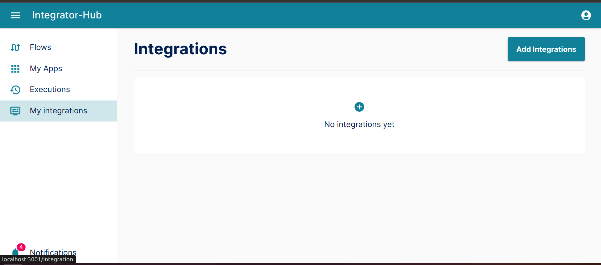

# Overview
:::info

The build integrations section is best understood when read from beginning to end. To get the most value out of it, start from the first page and read through page by page.

1. [<mark>Overview page</mark>](/integrator-hub/overview)
2. [Auth](/integrator-hub/authentication)
3. [Triggers](/integrator-hub/triggers)
4. [Actions](/integrator-hub/actions)

:::

:::info

Below, is the integrations page. To create an integration, click on Add integration button
and you will start building you own integration.

:::

:::info
To create you own integration you should fill the following fields and pass through the rest steps.

:::

## Name

:::info
Please input your app's actual name exactly as it appears in your branding and website, preserving the same capitalization and spacing. Please refrain from including trademark or copyright symbols, as well as any extra descriptions, adjectives, or taglines.
:::

## Key

:::info
This key is used to identify the integration
:::

## Logo

:::info
Upload your app’s logo. Make sure your logo is a svg.
Integrator-hub will use your logo full-size in the apps Directory to promote the integration, and will automatically re-size it to use inside the editor and in other parts of the app.
:::

## Description

:::info
Include a description in up to 140 characters of your app’s core features and use-case,
for example “Trello is team collaboration tool to organize tasks on a kanban board and keep projects on track.”
Do not include overstated language, such as that your app is most popular or best.
Additionally, do not mention Zapier. Focus instead on why someone would use your app.

Use proper English, complete sentences, and punctuation. Do not include links or formatting.
:::

## Api Base Url

:::info
This is the url of the API of your integration.
:::

## App Base Url

:::info
This is the url of the app itself.
:::

## support connections

:::info
To determine if the integration needs authentication or not.
:::

## Overview Page

:::info
After creating the new integration, you will be directed to the overview page.
In the overview page you can configure the authentication, triggers and actions of your new integration.
:::

