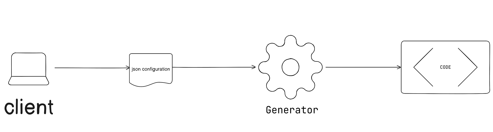

# Code Generator 



the Generator is a tool that helps you to generate the code of your integration, it uses the request body as a cofiguration file to generate the code.

for example to create the authentication files the request body is like: 

```json
{
  "fields": [
    {
      "key": "screenName",
      "label": "Screen Name",
      "type": "string",
      "required": true,
      "readOnly": false,
      "value": null,
      "placeholder": null,
      "description": "Screen name of your connection to be used on Automatisch UI.",
      "clickToCopy": false
    },
    {
      "key": "api_key",
      "label": "API Key",
      "type": "string",
      "required": true,
      "readOnly": false,
      "value": null,
      "placeholder": null,
      "description": "API key of Zendesk API service.",
      "clickToCopy": false
    }
  ],
  "verifyEndpoint": "/customers",
  "headers": {
      "Authorization": "`Bearer ${$.auth.data.api_key}`"
  }
}

```

and it generates the following files:

```
auth
├── index.ts
├── is-still-verified.ts
└── verify-credentials.ts
```

```typescript
// index.ts
import verifyCredentials from './verify-credentials';
import isStillVerified from './is-still-verified';

export default {
  fields: [
    {
      key: 'screenName',
      label: 'Screen Name',
      type: 'string' as const,
      required: true,
      readOnly: false,
      value: null,
      placeholder: null,
      description:
        'Screen name of your connection to be used on Automatisch UI.',
      clickToCopy: false,
    },
    {
      key: 'authToken',
      label: 'API Key',
      type: 'string' as const,
      required: true,
      readOnly: false,
      value: null,
      placeholder: null,
      description: 'API key of Dstny API service.',
      clickToCopy: false,
    },
  ],
  verifyCredentials,
  isStillVerified,
};
```

```typescript
// verify-credentials.ts
import { IGlobalVariable } from '@automatisch/types';

const verifyCredentials = async ($: IGlobalVariable) => {
  await $.http.get('/customers?limit=1&page=1&');

  await $.auth.set({
    screenName: $.auth.data.screenName,
    apikey: $.auth.data.apikey,
  });
};

export default verifyCredentials;

```

```typescript
// is-still-verified.ts
import { IGlobalVariable } from '@automatisch/types';
import verifyCredentials from './verify-credentials';

const isStillVerified = async ($: IGlobalVariable) => {
  await verifyCredentials($);
  return true;
};

export default isStillVerified;
```


## Runtime Generated Code

This Diagram shows how the code is generated and executed at runtime. [See the diagram](https://wbd.ms/share/v2/aHR0cHM6Ly93aGl0ZWJvYXJkLm1pY3Jvc29mdC5jb20vYXBpL3YxLjAvd2hpdGVib2FyZHMvcmVkZWVtLzgzYWE3NWQ3ZDk5ZDRkMGM5ZjQxMTliNGQ4MjEwYTgxXzVmY2M5ZDliLWUzZDMtNGUxOS1hYzBjLTkwYWFjYWU2NzdjZl9jODUzZTYwMC1hZDI0LTQyNGYtODcwOS04ZmFmYmRmOTc2NDE=)